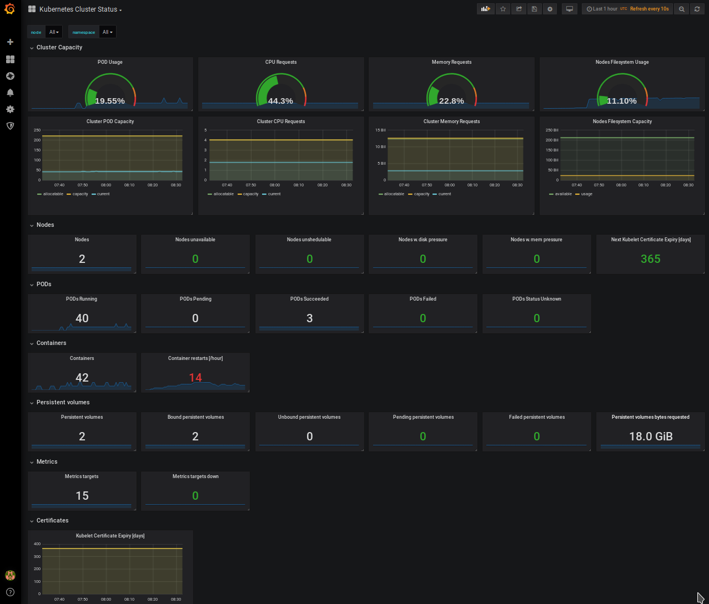
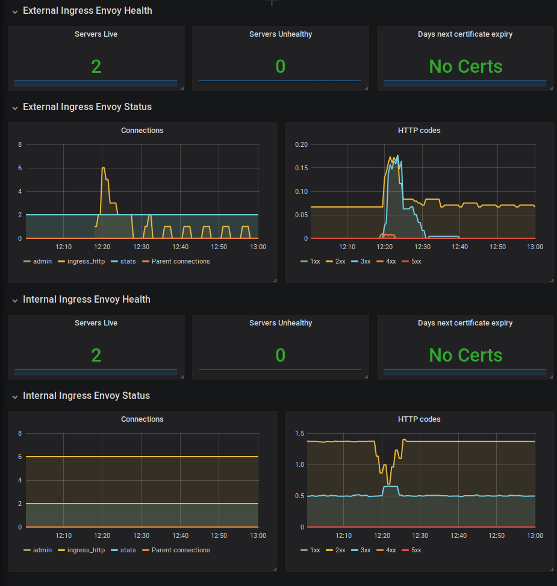

A Helm chart for deploying a code-based Kubernetes Grafana dashboard. 

If you think that storing Grafana dashboards .JSON files in git feels like
storing a disassembled binary instead of source code, look no further.

This chart allows dashboards to be defined using Python with the assistance of
[Grafanalib](https://github.com/weaveworks/grafanalib) for propagating the
dashbaords to Grafana.

Defining dashboards with code have a number of benefits:

- Better readability, compact code instead of redundant .JSON.

- Understandable diffs when commited to git, i.e. since the dashboards are code,
  the diffs will look like normal code diffs.  Loading, editing and saving
  Grafana .JSON files could potentially create huge changes in the .JSON file.

- Easy editing using a text editor. Also, since many individual gauges are
  identical, it is easy to build functions to create these and thus reduce the
  amount of boilerplate enormously.

- Configurable dashboards based on e.g. chart values. The example dashboard
  illustrates this with a configurable dashboard title.

- If you have variables in your dashboard that are based on label values
  (e.g. typical for host and namespace names), saving the .JSON file may cause
  these names to be included in the .JSON which is very undesirable for a
  generic dashboard.

See the dashboards folder for an example dashboard, and note that the Grafana
.JSON files are not part of the chart and only exists temporarily while the
Kubernetes job defined by this chart is executed.

Using Helm for deploying dashboards also allows for Helm workflows to be used
while developing dashboards.  Simply re-apply the chart and you have the
dashboard available in Grafana within seconds.

Note that this requires the sidecar in Grafana for dynamic provisioning of
dashboards must enabled.

## How It Works

This is how it works:

1. Helm deploys the chart, which includes a Configmap with the dashboard Python code

2. The Configmap is mounted into a Kubernetes Job, which has three containers,
two of which are init-containers.

3. The first container converts the Python code into a .JSON file and stores it
into a ephemeral volume shared between the containers.

4. The second container creates a new Configmap from the .JSON file. This is
done using kubectl and a serviceaccount created by Helm.  The serviceaccount is
necessary since the default serviceaccounts may not allow the container to
create resources.

5. The third container labels the newly created Configmap such that it is picked
up by the Grafana sidecar for dynamic dashboard deployment.

## Drawbacks

There are a few:

- Initially it is easiler to create dashboards using Grafana directly. However,
  once the basic gauges have been created, most of the dashboard development is
  simply Python coding.  The [example dashboard](dashboards/kubernetes-health.py)
  might be a good starting point.

- Grafanalib does not support all features of Grafana and the Grafanalib
  documentation is not voluminous.  However, since it is just Python code, it is
  easy to read.  Reading the code and comparing to existing .JSON dashboards is
  also a good approach to understanding Grafanalib.

- Since Grafanalib is written in Python, the container image used for converting
  from Python to .JSON is about 150MB.

## Example Dashboard

The [example Kubernetes health dashboard](dashboards/dashboard-kubernetes-health.py) is shown here:

The [example Envoy dashboard](dashboards/dashboard-envoy.py) is shown here:

